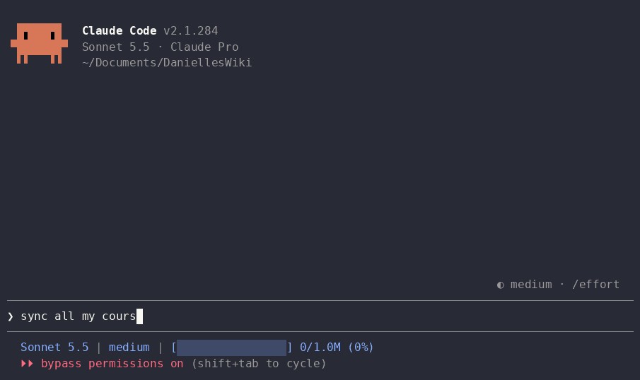

# Corum

Corum is a toolkit that helps you maintain a Canvas vault for your AI agent. It exists to remove the overhead students spend on task tracking and integration with Canvas.

## Motive

As NUS students, we spend so much unnecessary time tracking our submission deadlines when we've got better things to do, like actually studying.

Corum offers a solution by letting your agent take over. You get oversight of all your deadlines and tasks through your favourite task tracking platform, and you do your revision within the vault, without manually downloading lecture notes and feeding them to GPT.

## The problem

Keeping up with courses on Canvas is a massive headache for students on top of actually studying:

- **We forget what's new.** We're keeping track of more than 5 courses, and we can't remember which announcements we've already seen since last time.
- **We have to monitor everything.** Announcements drop at any time, so we keep notifications on and keep checking. Sometimes lecturers don't even update the assignment due date and only send an announcement.
- **We track tasks by hand.** We copy deadlines, lectures and labs into a tracker ourselves, and redo it whenever something changes.
- **Course materials are everywhere.** There's no central place to see all the materials across all our courses.

## What Corum does

Corum gives your agent one local vault with all materials from all your tracked courses, and keeps it synced to Canvas.

- `corum sync` downloads each course's lectures, announcements, assignments, pages, files and syllabus into the vault.
- Each sync lists what is new or changed since last time: a new announcement, a moved due date, an updated page.
- Your agent reads that list and updates your tracker with the tasks you need to do.

## Installation

```console
curl -fsSL https://raw.githubusercontent.com/algebananazzzzz/Corum/main/install.sh | sh
```

Works on macOS and Linux. You need a Canvas account and Claude Code or Codex. A task tracker is optional.

## Usage

Create a vault. `corum init` walks you the whole process, integration with Canvas, the courses to track and your task tracker:

```console
corum init
```


Then start Claude Code or Codex in the vault and send a prompt like `sync all courses`:

```console
cd path-to-vault
claude    # or codex
```



The agent runs `corum sync`, reads what changed and proposes a plan for each course.

Configure a vault later with `corum configure`: replace the Canvas token, add or drop courses, or switch trackers.

```console
corum configure            # settings menu
corum configure tracker    # task tracker only
corum configure canvas     # Canvas token and courses only
corum doctor               # check the vault
corum update               # install the latest release
```

## Additional recommended tools

- [Obsidian](https://obsidian.md) opens the vault as a folder, so you can read your course materials, follow links between notes and search across all your courses.
- Build your own LLM wiki on top of the vault: see Andrej Karpathy's [LLM Wiki](https://gist.github.com/karpathy/442a6bf555914893e9891c11519de94f).
