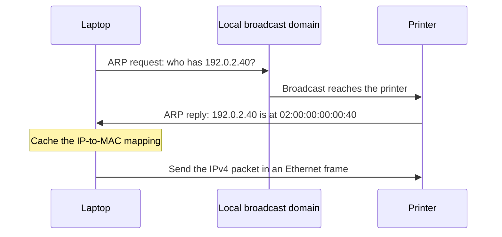

# Address Resolution Protocol (ARP)

**ARP:** discovers the MAC address associated with an IPv4 address on the local network.

## ARP Request and Reply

1. **Request broadcast:** the sender asks every device on the local network, “Who has this IP address?”
2. **Reply unicast:** the device with that IP address normally answers the sender directly, supplying its MAC address.
3. **Cache update:** the sender stores the IP-to-MAC mapping and uses it to deliver Ethernet frames.

A usable cached mapping lets the sender transmit immediately. A missing mapping triggers the exchange. [ARP overview](https://www.geeksforgeeks.org/computer-networks/arp-protocol/)

> [!example] Finding the Printer
> A laptop at `192.0.2.10` wants to reach a printer at `192.0.2.40` on the same LAN. The laptop has no cached mapping for the printer.
>
> - **Request:** “Who has `192.0.2.40`? Tell `192.0.2.10`.”
> - **Reply:** “`192.0.2.40` is at `02:00:00:00:00:40`.”
> - **Result:** the laptop addresses its data frame to `02:00:00:00:00:40`.



## ARP Message Format

ARP travels directly inside an Ethernet frame with EtherType `0x0806`. For Ethernet and IPv4, the ARP message is **28 bytes**; its address-length fields specify six-byte MAC addresses and four-byte IPv4 addresses. [RFC 826](https://datatracker.ietf.org/doc/html/rfc826)

> [!figure] ARP Message: Ethernet and IPv4
> ![[arp-message-format.svg]]

- **Hardware and protocol:** identify the address types being mapped.
- **Address lengths:** determine the sizes of the four address fields.
- **Operation:** distinguishes a request (`1`) from a reply (`2`).
- **Sender pair:** advertises the message sender's MAC and IP addresses.
- **Target pair:** identifies the device being queried or answered.

> [!warning] Ethernet Type vs Protocol Type
> `0x0806` in the **Ethernet header** identifies an ARP message. `0x0800` in the **ARP message** identifies IPv4 as the protocol whose address is being resolved.

### Request and Reply Fields

Consider the printer example with laptop MAC `02:00:00:00:00:10`. The reply advertises the printer as its sender and addresses the laptop as its target.

| Field | Request | Reply |
| --- | --- | --- |
| Ethernet destination | `ff:ff:ff:ff:ff:ff` | `02:00:00:00:00:10` |
| Operation | `1` | `2` |
| Sender MAC | `02:00:00:00:00:10` | `02:00:00:00:00:40` |
| Sender IP | `192.0.2.10` | `192.0.2.40` |
| Target MAC | `00:00:00:00:00:00` | `02:00:00:00:00:10` |
| Target IP | `192.0.2.40` | `192.0.2.10` |

The request uses zeros for the unknown target MAC in this example. Frame delivery uses the Ethernet broadcast address; the ARP target MAC is the value being sought. [RFC 826, packet generation](https://datatracker.ietf.org/doc/html/rfc826)

## ARP Cache

**ARP cache:** stored IP-to-MAC mappings that let a device reuse an earlier resolution.

- **Reuse:** subsequent frames can use a cached mapping.
- **Refresh:** dynamic entries are aged or revalidated to account for changes.
- **Failure:** an unanswered request can be retried; resolution eventually fails if the target remains unreachable.

Cache aging and retry behavior depend on the implementation. [RFC 1122, §2.3.2](https://www.rfc-editor.org/rfc/rfc1122.html#section-2.3.2)

> [!tool] Inspect Cached IPv4 Neighbours on Linux
> ```bash
> ip -4 neigh show
> ```
>
> Illustrative output:
>
> ```text
> 192.0.2.40 dev eth0 lladdr 02:00:00:00:00:40 REACHABLE
> ```
>
> The entry maps the printer's IP to its MAC on `eth0`. `REACHABLE` means reachability was recently confirmed; `STALE` means the retained mapping needs confirmation. [ip-neighbour manual](https://www.man7.org/linux/man-pages/man8/ip-neighbour.8.html)

## Reaching a Remote Destination

Routing chooses the next hop. For a remote destination reached through a gateway, the sender resolves the **gateway's local IP address**. [RFC 1122, §3.3.1](https://www.rfc-editor.org/rfc/rfc1122.html#section-3.3.1)

> [!example] Sending Through a Gateway
> The laptop sends to server `198.51.100.20` through gateway `192.0.2.1`.
>
> - **ARP target:** `192.0.2.1`, the gateway.
> - **Ethernet destination:** the gateway's MAC address.
> - **IPv4 destination:** `198.51.100.20`, the server.

==ARP resolves the local next hop's MAC address.==

---

## Sources

- **Teaching reference:** [GeeksforGeeks: ARP](https://www.geeksforgeeks.org/computer-networks/arp-protocol/).
- **Protocol specification:** [RFC 826](https://datatracker.ietf.org/doc/html/rfc826).
- **Host behavior:** [RFC 1122](https://www.rfc-editor.org/rfc/rfc1122.html).
- **Command reference:** [ip-neighbour manual](https://www.man7.org/linux/man-pages/man8/ip-neighbour.8.html).
