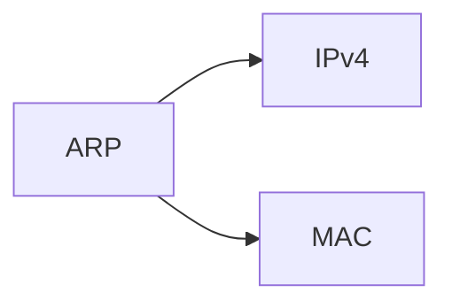
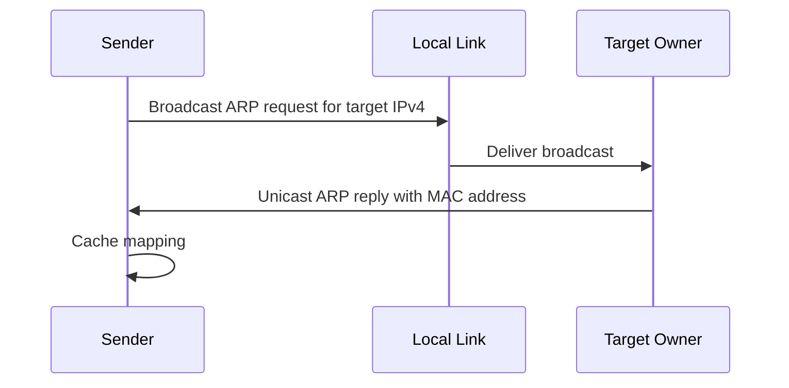

# Authoring with Markdown

Read [Markdown conventions](markdown-conventions.md) for the vault syntax contract. This guide shows how to shape knowledge into pages that can be understood, scanned, and reused. It applies to every wiki tier; the target-specific teaching, research, and compression rules live in `SKILL.md`.

## Core principle

Choose the representation that makes the idea easiest to understand. A page is not a transcript of its course source. For a concept page, course material establishes why the topic matters in the course; reputable secondary explanations may provide the teaching backbone and the additional scope needed to understand the concept itself.

Use a block only when it serves a distinct reading job. Do not add headings, callouts, tables, or figures merely to make a page look structured.

## Quick selection guide

| Knowledge shape | Best representation |
| --- | --- |
| A term and its meaning | `**Term** — definition` |
| A small set of parallel facts | Bullets with bold scan labels |
| A meaningful sequence | Numbered list |
| Repeated comparison dimensions | Table |
| A formula or compact relationship | Mathematics with symbols defined nearby |
| Messages, state changes, or branching | Mermaid |
| Spatial, technical, or nested structure | Draw.io diagram |
| A real command and its observation | `[!tool]` |
| A worked application or trace | `[!example]` |
| A material outside-course addition or disagreement | `[!research]` |
| An answer-changing trap | `[!warning]` |
| A visual that earns reading space | `[!figure]` |

## Research, sources, and scope

### Give sources different jobs

| Source | Job in a concept page |
| --- | --- |
| Course material | Course relevance, terminology, emphasis, and assessed knowledge |
| Reputable secondary explainer | Digestible teaching model, expanded context, examples, visuals, and a coherent concept-level scope |
| Primary or official source | Exact semantics, standards, APIs, registered values, security-sensitive claims, and disagreements |

Write every concept from a reputable secondary explanation as well as its course material. The secondary source must shape the teaching, not sit unused in the Sources list. Do not merely paraphrase the slides and append a research paragraph. Expand through the prerequisites, normal operation, important variants, limitations, failure modes, and examples needed to understand the named concept. When another idea becomes independently useful, link to the concept that owns it instead of absorbing it.

A slide-derived summary is not a finished concept page. If time or access prevents the required secondary research, leave the item as a source note or draft rather than publishing it as a concept. A deadline changes how concisely the page is written; it does not turn the course source into the page's teaching backbone.

GeeksforGeeks can be a useful secondary explainer for approachable computing concepts. It is not the authority for protocol semantics, standards, security claims, or disputed details; verify those against an RFC, standard, vendor documentation, paper, or another primary source.

### Place evidence where it helps

Keep the complete source inventory in the page metadata or Sources section required by its template. Keep captured-course provenance in its `%% {{source}} p{{range}} %%` comment beneath the heading it supports.

For researched material, link or footnote the claim or paragraph that depends on it. Use `[!research]` only when the reader benefits from knowing that material is an important external addition, qualification, or conflict.

**Weak**

```markdown
> [!research]
> ARP entries can be poisoned. Source: RFC 826.
```

**Better**

```markdown
An unsolicited ARP reply can overwrite a cached mapping on many hosts, which
creates the basis for ARP spoofing.[^arp-spoofing]

[^arp-spoofing]: [ARP and its security limitations](https://datatracker.ietf.org/doc/html/rfc826)
```

The evidence is adjacent to the claim; the page-level source inventory still records the source as a whole.

## Page structure

Use one `#` title. Use `##` for the page's meaningful divisions and `###` for genuine subdivisions; do not go deeper. Heading names should identify retrievable knowledge, not generic containers.

**Weak**

```markdown
## ARP

### Process

#### More details
```

**Better**

```markdown
## Resolving a Local Destination

### Cache Miss
```

There is no required concept-page anatomy. Choose a structure that fits the idea: a protocol may follow a packet's path, a proof technique may follow its reasoning steps, and a financial statement may follow what it represents and how to read it. An `[!abstract]` callout is useful when a short orientation helps; it is never required decoration.

Use `---` to separate substantial regions, such as an opening orientation from the main explanation or the explanation from sources. Do not put one between every neighbouring heading.

## Prose, definitions, and lists

Paragraphs introduce, connect, or interpret blocks. Keep them to three sentences or fewer. If a sentence contains parallel facts, use a list instead.

**Weak**

```markdown
ARP is used on local networks, sends a request, receives a reply, stores the
result, and can be attacked with spoofed replies.
```

**Better**

```markdown
- **Scope:** resolves an IPv4 address only on the local link.
- **Request:** asks which host owns the target address.
- **Cache:** remembers a discovered mapping for later frames.
- **Risk:** accepts a mapping model that can be abused by spoofed replies.
```

Every bullet and numbered item starts with a bold scan label of fewer than five words followed by a colon. Use bullets for a family of facts and numbered lists only when reordering changes the meaning.

```markdown
1. **Check Cache:** look for a fresh mapping of the next-hop IPv4 address.
2. **Broadcast Request:** ask every host on the local link for the owner.
3. **Store Reply:** cache the owner's MAC address before sending the frame.
```

Write definitions as the term followed by its meaning.

```markdown
**ARP** — resolves a local IPv4 address to the link-layer address used to send a frame.
```

Use inline code for literal commands, fields, filenames, flags, and values. Use emphasis to expose scan structure, not to make ordinary prose look important. Use mathematics only when it compresses a relationship without hiding its meaning, and define every symbol near its first use.

```markdown
Transmission delay is $L/R$, where $L$ is packet length and $R$ is link rate.
```

## Callouts

Callouts give a block a special reading role. Use them where that role helps; do not place one of each type on every page.

```markdown
> [!{{type}}] {{optional title}}
> {{content}}
```

| Callout | Use it for |
| --- | --- |
| `[!abstract]` | A compact orientation: what this is and why it exists |
| `[!example]` | A worked example, trace, or application |
| `[!example]-` | A folded answer for self-testing |
| `[!tool]` | A command and the observation it should produce |
| `[!research]` | A significant external addition, qualification, or conflict |
| `[!warning]` | A likely mistake or answer-changing edge case |
| `[!tip]` | An intuition, analogy, or mnemonic |
| `[!quote]` | A short attributed primary-source quotation |
| `[!figure]` | A visual with optional explanatory text |

**Weak warning**

```markdown
> [!warning]
> ARP uses a broadcast.
```

**Useful warning**

```markdown
> [!warning]
> ARP resolves the next hop on the local link, not necessarily the final IP destination.
```

## Tables

Use a table when the reader needs to compare several subjects across the same dimensions. Give every column one stable meaning and place the identifying dimension first. Keep qualitative tables to five rows or fewer; enumerative material such as fields, values, and ordered records may run to its natural length. Never hide a paragraph in a table cell.

**Weak**

```markdown
| Protocol | Details |
| --- | --- |
| ARP | It maps IPv4 to MAC addresses, broadcasts requests, replies unicast, caches entries, and can be spoofed. |
```

**Better**

```markdown
| Aspect | ARP |
| --- | --- |
| Purpose | Resolve local IPv4 addresses to link-layer addresses |
| Request | Broadcast to the local link |
| Reply | Usually unicast to the requester |
| Result | Cached IPv4-to-MAC mapping |
| Limitation | No built-in authentication |
```

## Links, embeds, and ownership

Link supporting knowledge with a short readable alias. Link to a section when the reader needs one exact idea.

```markdown
See [[courses/{{COURSE}}/wiki/concepts/IP Addressing|IP addressing]].
See [[courses/{{COURSE}}/wiki/concepts/IP Addressing#Local Delivery|IP addressing: local delivery]].
```

Embed a section only when the reader needs its content in the current reading path. Do not copy shared material into multiple pages; update the owning page instead.

```markdown
![[courses/{{COURSE}}/wiki/concepts/IP Addressing#Subnet Mask]]
```

Use footnotes for optional qualifications or citation detail, not for definitions or answer-changing exceptions.

## Visuals and diagrams

Actively look for a visual while researching a concept. Include one when a diagram, illustration, packet layout, trace, graph, or annotated example makes the model materially clearer. Do not manufacture a visual for an idea that is already clearest as a short definition, list, formula, or table.

Choose the format that matches the knowledge:

| Visual shape | Use |
| --- | --- |
| Process, messages, branches, or state transitions | Mermaid |
| Packet layout, topology, nesting, or component structure | Editable Draw.io pair |
| Real-world or irreducible explanatory image | Source image in a `[!figure]` callout |
| Stable repeated dimensions | Table, not a diagram |

Use a secondary source's visual when its reuse terms permit it and record that source at page level. If reuse is unclear, link or embed it from the source where suitable. If neither option is appropriate, recreate the factual content in Mermaid or Draw.io without copying the visual's expressive design. A figure caption is optional; add one only when it directs the reader to a useful observation.

**Weak Mermaid use**



**Useful Mermaid use**



The second diagram reveals message order and actors; the first merely restates a relationship that prose can say faster.

## Commands, code, and figures

Use a code block only for material the reader must reproduce or inspect literally. Label every fence and separate a command from expected output.

````markdown
```console
arp -a
```

Expected result:

```text
? (192.0.2.10) at 00:11:22:33:44:55 on en0
```
````

Wrap a chosen visual in `[!figure]` when that makes it a deliberate part of the reading path. The source belongs in the page-level inventory; add a caption only if it improves interpretation.

```markdown
> [!figure]
> ![[courses/{{COURSE}}/wiki/assets/arp-exchange.drawio.svg]]
> The reply is unicast, but the request reaches every host on the local link.
```

## Complete pattern

```markdown
## Resolving a Local Destination
%% {{LECTURE}} p18-22 %%

**ARP** — resolves the IPv4 address of a local next hop to the link-layer
address needed for frame delivery.

1. **Check Cache:** look for a fresh mapping before sending a request.
2. **Broadcast Request:** ask the local link which host owns the target IPv4 address.
3. **Cache Reply:** store the owner's MAC address after receiving its reply.

> [!figure]
> ![[courses/{{COURSE}}/wiki/assets/arp-exchange.drawio.svg]]

> [!warning]
> The target is the next hop on the local link. A remote destination is reached
> through the default gateway's MAC address instead.

An unsolicited reply can replace a cached mapping on many hosts, which makes
ARP spoofing possible.[^spoofing]

[^spoofing]: [ARP](https://datatracker.ietf.org/doc/html/rfc826)
```

The heading identifies the idea, the definition supplies the model, the ordered list preserves the mechanism, the visual earns its place, the warning prevents a common error, and the external claim carries local evidence.
