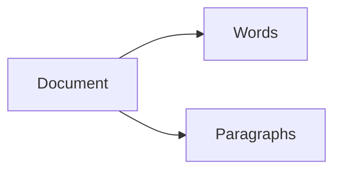
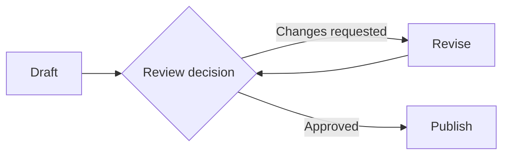

# Authoring Markdown

Write a page the reader can understand and scan. Lead with the subject's defining mechanism; use short conventions and concrete examples to shape each block.

Each block uses a subject suited to its purpose. Read the complete [ARP example](../examples/arp.md) for page-level pacing and block composition. Page-specific scope, research, and teaching requirements live in [Authoring Wiki](../SKILL.md).

## Page Order and Headings

Use one `#` title, `##` for the subject's logical parts, and `###` for their subdivisions. Name headings with familiar subject terms, such as Algorithm and Complexity. Start with a one-line definition, then the defining mechanism.

**Bad**

```markdown
# Binary Search

## Halving the Search Interval
## Following One Search
## Handling Missing Values
## Search Cost
```

**Good**

```markdown
# Binary Search

**Binary search:** finds a target in sorted data by repeatedly halving the search interval.

## Algorithm
### Preconditions
### Procedure
## Complexity
### Time Complexity
### Space Complexity
```

Let section boundaries follow logical seams in the subject. Place worked examples and edge cases within the section they explain. The subject determines which sections are useful.

## Definitions and Paragraphs

Write definitions as `**Term:** meaning`. Keep paragraphs to three sentences or fewer; use them to introduce, connect, or interpret the surrounding blocks. Use colons, commas, parentheses, and full stops for punctuation.

**Bad**

```markdown
Caching is an extremely important technique that plays a crucial role in
improving performance across a wide range of systems, and understanding it
requires us to explore many aspects of computing.
```

**Good**

```markdown
**Cache:** stores a reusable copy of data that is expensive to retrieve or compute.

A cache hit returns the stored result. A cache miss requires fetching or computing it first.
```

## Inline Formatting

Use bold for terms and scan labels, inline code for literal values and syntax, and italics for a small distinction. Highlight the page's main takeaway once with `==…==`.

**Bad**

```markdown
Use **reverse=True** with sorted because **this is extremely important**.
```

**Good**

```markdown
**Descending order:** `sorted(values, reverse=True)` returns a *new* list ordered from largest to smallest.

==`sorted()` preserves the original list.==
```

## Lists and Steps

Begin each item with a bold label of one to four words and a colon. Use bullets for parallel facts, numbering for a meaningful sequence, and checkboxes for verifiable completion.

**Bad**

```markdown
1. Change the amount of light.
2. Measure plant growth.
3. Keep watering consistent.
```

**Good: parallel facts**

```markdown
- **Independent variable:** daily light exposure.
- **Dependent variable:** plant height after two weeks.
- **Controlled variable:** water supplied per day.
```

**Good: sequence**

```markdown
1. **Tare balance:** zero the reading with the empty container in place.
2. **Add sample:** place the sample inside the container.
3. **Record mass:** read the stable measurement and include its unit.
```

**Bad: completion**

```markdown
- [ ] Understand everything.
```

**Good: completion**

```markdown
- [ ] **Labels present:** each graph axis names its quantity and unit.
- [ ] **Data matched:** plotted values agree with the measurement table.
```

## Tables

Compare subjects across logical dimensions such as description, complexity, and applications. Give each subject one short description sentence that includes its operations. Express applications as concrete actions the reader can recognize. Put the dimension first and state assumptions beside implementation-dependent claims. Keep qualitative comparisons to five data rows or fewer; field inventories and schedules use as many rows as the content requires.

**Bad**

```markdown
| Structure | Details |
| --- | --- |
| Stack | Stores items, supports adding and removing them, and is useful for undo history. |
```

**Good**

```markdown
|  | Stack | Queue |
| --- | --- | --- |
| Description | Adds and removes items at the top, so the newest item leaves first. | Adds items at the back and removes them from the front, so the oldest item leaves first. |
| Time complexity | Push, pop, peek: $O(1)$ | Enqueue, dequeue, peek: $O(1)$ |
| Space complexity | $O(n)$ | $O(n)$ |
| Applications | Reversing the most recent edit in a text editor | Printing documents in the order they were submitted |

Here, $n$ is the number of stored items. Complexities assume a linked stack with a top pointer and a linked queue with front and rear pointers.
```

Keep each cell to a compact fact. Refer to the relevant table row when a use case needs information already presented there.

**Bad: repeating the table**

```markdown
Stacks add and remove items at the top, so the newest item leaves first. Queues add items at the back and remove them from the front, so the oldest item leaves first. Both use $O(n)$ space.
```

**Good: referring to the table**

```markdown
To choose a structure for a text editor's Undo feature, refer to the comparison table above.
```

## Callouts

Give each callout one reading purpose and a short, specific title.

| Type | Purpose |
| --- | --- |
| `[!abstract]` | Orientation when the subject benefits from it |
| `[!example]` | Concrete input, steps, and result |
| `[!example]-` | Folded question and answer |
| `[!tool]` | Command and interpretation of its output |
| `[!warning]` | Likely mistake that changes the answer |
| `[!tip]` | Intuition, analogy, or memory aid |
| `[!research]` | Significant external addition or source disagreement |
| `[!quote]` | Exact attributed quotation |
| `[!figure]` | Diagram or explanatory image |

**Bad**

```markdown
> [!warning] Important
> Averages are useful in statistics.
```

**Good**

```markdown
> [!warning] An Outlier Can Shift the Mean
> For `3, 4, 5, 6, 82`, the mean is `20`, while the median is `5`. The median better represents the middle of this particular set.
```

### Worked Examples and Self-Checks

Supply a concrete starting situation and a result the reader can follow.

**Bad**

```markdown
> [!example]
> Imagine solving an equation.
```

**Good**

```markdown
> [!example] Solve $3x + 6 = 18$
> Apply the same operation to both sides to preserve equality.
>
> 1. **Subtract six:** $3x = 12$.
> 2. **Divide by three:** $x = 4$.
> 3. **Check:** $3(4) + 6 = 18$.

> [!example]- Check Your Understanding
> **Question:** solve $2x + 5 = 13$.
>
> **Answer:** subtract five, then divide by two: $x = 4$.
```

### Quotations and Research

Use exact quotations with attribution. Integrate ordinary sourced facts into the explanation; reserve research callouts for a distinction the reader benefits from recognizing.

**Bad**

```markdown
> [!quote]
> Readability matters.

> [!research]
> Python can sort lists.
```

**Good**

```markdown
> [!quote] Tim Peters: The Zen of Python
> “Readability counts.”
>
> [PEP 20](https://peps.python.org/pep-0020/).

> [!research] Equal Sort Keys Preserve Input Order
> Beyond arranging keys, Python guarantees a stable sort: records with equal keys retain their original order. This supports sorting on a secondary key before a primary key. [Python Sorting HOWTO](https://docs.python.org/3/howto/sorting.html#sort-stability-and-complex-sorts)
```

## Commands and Code

Label every fence with its language. Keep executable input and illustrative output in separate blocks. Explain what the reader should observe.

**Bad**

```markdown
Run Python to sort the values and it prints the answer.
```

**Good**

````markdown
> [!tool] Sort a List in Python
> ```bash
> python3 -c 'print(sorted([3, 1, 2]))'
> ```
>
> Expected output:
>
> ```text
> [1, 2, 3]
> ```
>
> The returned list contains the same values in ascending order.
````

Use a code fence for material the reader will reproduce or inspect literally. Describe an algorithm with ordered steps when its reasoning is the focus.

## Mathematics

Use `$…$` inline and `$$…$$` for a displayed relationship. Define symbols and units beside the formula.

**Bad: inline delimiters**

```markdown
For (P(A\mid B)), condition on (B).
```

**Good: inline delimiters**

```markdown
For $P(A\mid B)$, condition on $B$.
```

**Bad**

```markdown
Energy is half m v squared.
```

**Good**

```markdown
**Kinetic energy:** $E_k = \tfrac{1}{2}mv^2$, where $m$ is mass in kilograms and $v$ is speed in metres per second.

For a $2\,\text{kg}$ object moving at $3\,\text{m/s}$:

$
E_k = \tfrac{1}{2}(2)(3^2) = 9\,\text{J}
$
```

## Diagrams and Figures

Use Mermaid for exchanges, sequences, branches, and state changes. Use editable Draw.io for packet layouts, topology, and spatial structure.

Give each diagram participant one concrete role. Show alternative paths as branches or separate examples.

**Bad: process diagram**



**Good: process diagram**



### Packet Layouts

Keep each address field whole. Put common values in parentheses. Use a bit ruler where box widths represent bit widths; identify which rows it describes.

| Element | Bad | Good |
| --- | --- | --- |
| Hardware type | Hardware type: 2 bytes | Hardware type (Ethernet = 1) |
| Protocol type | Protocol type: 2 bytes | Protocol type (IPv4 = 0x0800) |
| Address length | Hardware length (6) | Hardware length (6 bytes) |
| Address field | Sender MAC, first 4 bytes; Sender MAC, last 2 bytes | Sender MAC |
| Header ruler | An unlabeled scale spanning variable-length rows | 0, 8, 16, 24, 32 above the fixed header |

Use square corners. Keep the SVG and its editable `.svg.xml` sidecar synchronized through the Draw.io workflow. See the approved [ARP diagram](../examples/assets/arp-message-format.svg) and [editable source](../examples/assets/arp-message-format.svg.xml).

### Figure Embeds

Place figures in `courses/{{COURSE}}/wiki/assets/` and embed them in a figure callout. A caption earns its place by directing attention to an observation.

**Bad**

```markdown
> [!figure] Leaf Cross-Section
> ![[courses/{{COURSE}}/wiki/assets/leaf-cross-section.svg]]
> This diagram shows a leaf cross-section.
```

**Good**

```markdown
> [!figure] Leaf Cross-Section
> ![[courses/{{COURSE}}/wiki/assets/leaf-cross-section.svg]]
```

## Links and Footnotes

Give vault links readable aliases. Link to a section for one precise idea; embed the owning section when its content belongs in the current reading path. Place external citations beside the claims they support.

**Bad**

```markdown
Read more [here](https://docs.python.org/3/howto/sorting.html).
See Sorting.
```

**Good**

```markdown
Python preserves the relative order of equal sort keys. [Python Sorting HOWTO](https://docs.python.org/3/howto/sorting.html#sort-stability-and-complex-sorts)

See [[courses/{{COURSE}}/wiki/concepts/Sorting#Stable Sorts|sorting: stability]].

![[courses/{{COURSE}}/wiki/concepts/Sorting#Comparison Keys]]
```

Keep essential definitions and exceptions in the reading path. Use footnotes for optional detail.

**Bad**

```markdown
Calculate the median.[^meaning]

[^meaning]: The median is the middle value after sorting, or the mean of the two middle values for an even count.
```

**Good**

```markdown
**Median:** the middle value after sorting, or the mean of the two middle values for an even count.

The median of `3, 4, 5, 6, 82` is `5`.[^notation]

[^notation]: The median is also called the second quartile, $Q_2$.
```

## Metadata and Provenance

Start course pages with the selected template's YAML frontmatter. Quote wiki links inside YAML. Place exact course-source markers directly beneath the supported heading. Use digits and an ASCII hyphen for a contiguous range, such as `p6-7`; put disjoint ranges in separate markers.

**Bad**

```markdown
# Conservation of Energy
Source: lecture somewhere around pages 6 to 12.
```

**Good**

```markdown
---
tier: concept
course: "{{COURSE}}"
sources:
  - "[[courses/{{COURSE}}/raw/lectures/{{LECTURE}}.pdf]]"
---

# Conservation of Energy

## Exchanging Potential and Kinetic Energy
%% {{LECTURE}} p6-7 %%
%% {{LECTURE}} p11-12 %%

A falling object converts gravitational potential energy into kinetic energy.
```

Keep the complete source inventory in the template's metadata or Sources section. Ordinary standalone notes follow their task's metadata requirements.

## Spacing, Separators, and Escapes

Use blank lines between headings and content, between paragraphs and lists, and around fenced blocks. Keep a course provenance marker attached to its heading. Use horizontal rules for substantial boundaries such as the start of Sources.

**Bad**

```markdown
## Measurement Results
The samples differ in mass.
- **Largest mass:** sample C.
---
## Measurement Uncertainty
---
## Instrument Precision
```

**Good**

```markdown
## Measurement Results

The samples differ in mass.

- **Largest mass:** sample C.

## Measurement Uncertainty

Record the balance's precision alongside each reading.

---

## Sources
```

| Syntax | Bad | Good |
| --- | --- | --- |
| Placeholder | `<COURSE>` | `{{COURSE}}` |
| Prose arrow | `Draft -> Review` | `Draft → Review` |
| Table-cell pipe | An unescaped alias separator | `[[Page\|Alias]]` |
| HTML tag name | A bare tag in prose | The tag in inline code |

Keep diagram and code syntax native to their language, such as Mermaid's `->>` message arrow.

### Dates in Tables

Convert captured times to the workspace timezone and obtain week numbers from the configured term calendar.

**Bad**

```markdown
| Event | When |
| --- | --- |
| Lab | Next Tuesday afternoon |
```

**Good**

```markdown
| Event | When |
| --- | --- |
| {{EVENT}} | Week {{number}} \| {{Day}} {{day}} {{month}}, {{start}}-{{end}} |
```

## Review Before Delivery

- **Opening:** the definition and defining mechanism appear first.
- **Headings:** familiar subject terms identify logical sections and subdivisions.
- **Blocks:** each block explains, compares, demonstrates, or supports a specific idea.
- **Examples:** inputs and results are concrete and consistent.
- **Punctuation:** use colons, commas, parentheses, full stops, hyphens, and en dashes.
- **Visuals:** diagrams render clearly and their editable sources match.
- **Evidence:** source links support the adjacent claims.
