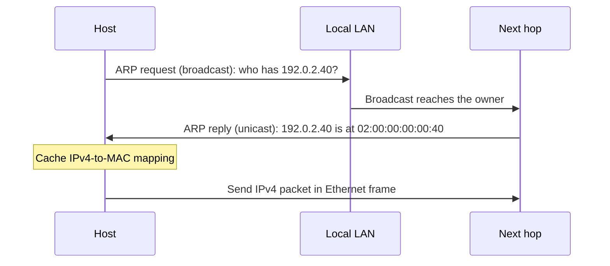

# Address Resolution Protocol (ARP)

**ARP:** maps an IPv4 address to the MAC address needed to deliver the next Ethernet frame on the local network.

## Why ARP is needed
%% L2 p4-5 %%

An IP packet describes an end-to-end destination, but Ethernet delivers one hop at a time. Before a host can hand an IPv4 packet to its Ethernet driver, it must know the MAC address of the next hop. ARP supplies that missing link-layer address; it does not discover a route or change the packet's IPv4 destination.

If the destination is on the local subnet, the next hop is the destination host. If it is remote, the next hop is the local interface of the default gateway. In both cases, ARP is confined to the local LAN or broadcast domain.

## Request, reply, and cache
%% L2 p6-7 %%

When the sender has no usable cached mapping, it performs a two-message exchange:

1. **Broadcast request:** send an ARP request to the LAN asking, “Who has this IPv4 address?” The Ethernet destination is `ff:ff:ff:ff:ff:ff`.
2. **Unicast reply:** the device that owns the requested IPv4 address answers the requester with its MAC address.
3. **Cache mapping:** the requester stores the IPv4-to-MAC pair and uses it for subsequent frames until the entry needs refreshing.

The broadcast does not cross a router. That is why a remote IPv4 destination is resolved indirectly: the host resolves the gateway's local IP-to-MAC mapping, then sends an Ethernet frame to the gateway while leaving the packet's final IPv4 destination unchanged.

> [!example] Resolving a Local Printer
> A laptop at `192.0.2.10` wants to send to a printer at `192.0.2.40`, and its cache has no entry for the printer.
>
> - **Request:** “Who has `192.0.2.40`? Tell `192.0.2.10`.” The request is broadcast.
> - **Reply:** “`192.0.2.40` is at `02:00:00:00:00:40`.” The printer sends this reply to the laptop.
> - **Result:** the laptop puts the IPv4 packet in an Ethernet frame addressed to `02:00:00:00:00:40` and records the mapping.

## ARP message format
%% L2 p9-10 %%

ARP is carried directly in an Ethernet II frame. For Ethernet and IPv4, the ARP payload is 28 bytes. The Ethernet EtherType is `0x0806`; inside the ARP payload, hardware type `0x0001` means Ethernet and protocol type `0x0800` means IPv4. [RFC 826](https://datatracker.ietf.org/doc/html/rfc826)

> [!figure] ARP Message Format
> ![[courses/CS3103/wiki/assets/arp-message-format.svg]]

| Field | Ethernet/IPv4 value | Purpose |
| --- | --- | --- |
| Hardware type | `0x0001` | Identifies Ethernet as the hardware address format. |
| Protocol type | `0x0800` | Identifies IPv4 as the protocol address format. |
| Hardware length | `6` | MAC address length in bytes. |
| Protocol length | `4` | IPv4 address length in bytes. |
| Operation | `1` request, `2` reply | States which ARP message is being sent. |
| Sender hardware/protocol address | Sender MAC and IPv4 address | Identifies the message sender. |
| Target hardware/protocol address | Target MAC and IPv4 address | Identifies the device being queried or answered. |

In a request, the target IPv4 address is known but the target MAC is not, so the target hardware field is conventionally zeroed (`00:00:00:00:00:00`). The Ethernet frame is still broadcast; the zero field is the unknown value being requested. The lecture's `0x8060` annotation is a typographical error: the registered Ethernet ARP EtherType is `0x0806`.

> [!example] Request and Reply Values
> Host A (`192.0.2.10`, MAC `02:00:00:00:00:10`) resolves Host B (`192.0.2.40`, MAC `02:00:00:00:00:40`).
>
> | | Request | Reply |
> | --- | --- | --- |
> | **Ethernet destination** | `ff:ff:ff:ff:ff:ff` | `02:00:00:00:00:10` |
> | **Operation** | `1` | `2` |
> | **Sender pair** | A's MAC and `192.0.2.10` | B's MAC and `192.0.2.40` |
> | **Target pair** | zero MAC and `192.0.2.40` | A's MAC and `192.0.2.10` |

## Cache lifecycle and variants
%% L2 p11-12 %%

**ARP cache:** a local table of recently learned IPv4-to-MAC mappings. Caching avoids a broadcast before every packet, but entries cannot be trusted forever because devices can leave, change interfaces, or become unreachable.

- **Missing host:** implementations retry an unanswered request with increasing intervals, then give up. The original IPv4 delivery fails because no next-hop MAC was learned.
- **Refresh:** some systems periodically re-request cached addresses. This keeps mappings current but adds LAN traffic.
- **Proxy ARP:** a host or router answers a request received on one connected network for a host on another network. It returns its own interface MAC, so the requester sends frames to the proxy, which forwards them onward.
- **Gratuitous ARP:** a host asks for its own IPv4 address. It can expose a duplicate address and announce or refresh its own IPv4-to-MAC mapping, including after a MAC change. It is useful operationally even though no ordinary lookup initiated it.

> [!example] Proxy ARP for a Remote Host
> Host A believes `198.51.100.20` is reachable on its local network, but the destination is actually beyond Router R. R answers A's ARP request with R's local MAC. A sends the frame to R; the IPv4 destination remains `198.51.100.20`, and R forwards the packet.

==ARP resolves the local next hop's MAC address, not necessarily the final destination's MAC address.==

## Trust, poisoning, and defenses
%% L2 p13-14 %%

ARP has no authentication. A receiver cannot cryptographically prove that a reply came from the owner of the claimed IPv4 address, and ARP replies can arrive without a preceding request. The protocol also permits a receiver to update an existing cache entry from the sender fields of an ARP packet, which gives forged traffic an opportunity to replace a legitimate mapping. [RFC 826](https://datatracker.ietf.org/doc/html/rfc826)

**ARP poisoning:** an attacker sends forged ARP messages that bind a victim's or gateway's IPv4 address to the attacker's MAC. Victims may then send traffic through the attacker, enabling interception or causing a denial of service. [Cisco Dynamic ARP Inspection](https://www.cisco.com/c/en/us/support/docs/switches/lan-switch-software/222274-troubleshoot-dynamic-arp-inspection-dai.html)

The lecture points to three defense directions:

- **Dynamic ARP Inspection (DAI):** a switch checks ARP sender bindings on untrusted ports against a trusted database, commonly the DHCP-snooping binding table, and drops invalid packets. Static bindings can cover non-DHCP hosts. [Cisco DAI guide](https://www.cisco.com/c/en/us/td/docs/switches/lan/c9000/sec-crypto/fhs-sisf/fhs-and-sisf-configuration-guide/dynamic-arp-inspection.html)
- **IPv6 NDP:** IPv6 uses Neighbor Discovery Protocol instead of ARP. NDP changes the message mechanism but does not automatically remove the trust issue; authenticated extensions are separate.
- **Centralized SDN handling:** a controller can maintain a network-wide binding view and have switches answer or filter ARP consistently, reducing independent host guesses.

---

## Sources

| Source | Role |
| --- | --- |
| [[courses/CS3103/raw/lectures/L2- Network Bootstrapping-ARP-DHCP.pdf]] | Course completeness baseline, pages 4–14 |
| [GeeksforGeeks: ARP Protocol](https://www.geeksforgeeks.org/computer-networks/arp-protocol/) | Secondary teaching structure for request/reply, caching, and variants |
| [RFC 826: An Ethernet Address Resolution Protocol](https://datatracker.ietf.org/doc/html/rfc826) | Packet fields, EtherType, and cache-update precision |
| [Cisco: Dynamic ARP Inspection](https://www.cisco.com/c/en/us/support/docs/switches/lan-switch-software/222274-troubleshoot-dynamic-arp-inspection-dai.html) | ARP poisoning and DAI defense details |
