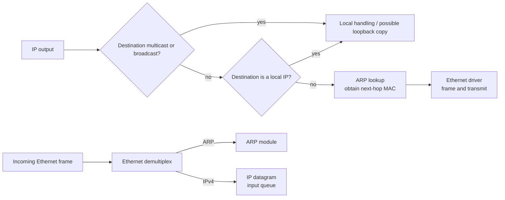
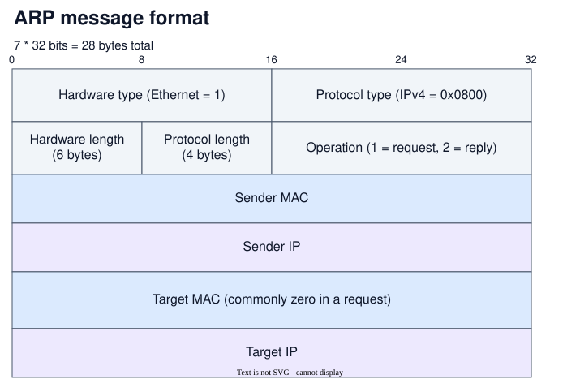

# Address Resolution Protocol (ARP)

**ARP:** discovers the MAC address associated with an IPv4 address so a host can send the next Ethernet frame.

## Request and reply
%% L2 p6-7 %%

If the sender has no usable cache entry, it asks the local network and then records the answer:

1. **Broadcast request:** the sender broadcasts, “Who has `192.0.2.40`? Tell `192.0.2.10`?” Every station in the local broadcast domain can receive it.
2. **Unicast reply:** the station that owns `192.0.2.40` replies to `192.0.2.10` with its MAC address.
3. **Cache update:** the requester stores the IPv4-to-MAC mapping and uses it for later Ethernet frames.

The broadcast is restricted to one LAN; a router does not forward it. If the final IPv4 destination is remote, the sender instead resolves the default gateway's local IPv4 address and puts the frame's destination MAC equal to the gateway's MAC.
[GeeksforGeeks: ARP Protocol](https://www.geeksforgeeks.org/computer-networks/arp-protocol/)

> [!example] One Resolution
> Laptop A is `192.0.2.10` with MAC `02:00:00:00:00:10`. Printer B is `192.0.2.40` with MAC `02:00:00:00:00:40`, and A has no cached entry.
>
> - **Request:** Ethernet destination `ff:ff:ff:ff:ff:ff`; target IPv4 `192.0.2.40`.
> - **Reply:** B sends A the mapping `192.0.2.40 → 02:00:00:00:00:40`.
> - **Data frame:** A sends the IPv4 packet in a frame addressed to `02:00:00:00:00:40`.

==ARP resolves the local next hop's MAC address; it does not replace the packet's final IPv4 destination.==

## Packet Processing
%% L2 p4-5 %%

End-to-end IP delivery becomes hop-to-hop Ethernet delivery. ARP is invoked only when an outgoing unicast packet needs a next-hop MAC that is not already available.

The slide is a simplified host-driver path: a local stack may receive a copy of multicast or broadcast traffic, but the sender can still transmit that traffic on the wire. ARP is simply not needed to choose a unicast MAC for an already broadcast or multicast destination. The input side does not run ARP for every received frame: the Ethernet driver demultiplexes an ARP packet to the ARP module and an IPv4 datagram to the IP input queue. [RFC 1122 §3.2.1](https://www.rfc-editor.org/rfc/rfc1122.html#section-3.2.1)

## ARP message format
%% L2 p9-10 %%

ARP is carried directly in an Ethernet II frame. The frame EtherType is `0x0806`; for the Ethernet/IPv4 case, the ARP payload identifies Ethernet as hardware type `0x0001`, IPv4 as protocol type `0x0800`, and operation `1` (request) or `2` (reply). [RFC 826](https://datatracker.ietf.org/doc/html/rfc826)

> [!warning] EtherType Typo on the Lecture Slide
> The slide prints `0x8060`, but the correct Ethernet ARP EtherType is `0x0806`.

> [!figure] ARP Message Format
> 

The address-length fields say how many bytes follow: six for a MAC address and four for an IPv4 address. The request knows the target IPv4 address but not its MAC, so its target hardware address is conventionally `00:00:00:00:00:00`; the Ethernet destination is still the broadcast address.

> [!example] Filled Request and Reply
> This extends the laptop/printer example above, filling the sender and target pairs for both messages.
>
> | Field | Request | Reply |
> | --- | --- | --- |
> | **Ethernet destination** | `ff:ff:ff:ff:ff:ff` | `02:00:00:00:00:10` |
> | **Operation** | `1` | `2` |
> | **Sender hardware address** | `02:00:00:00:00:10` | `02:00:00:00:00:40` |
> | **Sender protocol address** | `192.0.2.10` | `192.0.2.40` |
> | **Target hardware address** | `00:00:00:00:00:00` | `02:00:00:00:00:10` |
> | **Target protocol address** | `192.0.2.40` | `192.0.2.10` |

> [!warning] The Lecture's Padding Number
> The slide labels a 28-byte ARP message followed by 10 bytes of padding. Ethernet's minimum data field is 46 bytes, so a 28-byte ARP payload needs 18 bytes of padding before the 4-byte FCS. RFC 894 confirms the 46-byte minimum; the slide's `10` is therefore inconsistent with the standard frame-size calculation. [RFC 894](https://datatracker.ietf.org/doc/html/rfc894)

## Cache lifecycle and proxy ARP
%% L2 p11-12 %%

**ARP cache:** a local table of recently learned IPv4-to-MAC mappings. It avoids a broadcast before every packet, but entries must be retried, refreshed, or discarded as reachability changes.

- **Unanswered request:** implementations may retry with increasing intervals and eventually give up. Exact timers and retry counts are implementation-dependent; the Linux neighbour tool exposes states and timers rather than one universal ARP schedule. [ip-neighbour(8)](https://www.man7.org/linux/man-pages/man8/ip-neighbour.8.html)
- **Refresh:** systems may revalidate or periodically request cached neighbours. This keeps mappings current but adds traffic; RFC 1122 requires hosts to maintain ARP cache information but leaves cache timeout policy to the implementation. [RFC 1122 §2.3.2](https://www.rfc-editor.org/rfc/rfc1122.html#section-2.3.2)
- **Gratuitous ARP:** a host sends an ARP request for its own IPv4 address. It can detect duplicate assignment and update peers after an address/MAC change, even though no ordinary lookup triggered it.

**Proxy ARP:** a router answers an ARP request arriving on one connected network for a host on another. It returns its own interface MAC, so the requester sends the frame to the router; routing then forwards the unchanged IPv4 destination.

> [!example] Why the Proxy Answers
> The lecture's diagram shows Argon `128.143.137.144/16` on `128.143.0.0/16`, Router137 as `128.143.137.1/16` with MAC `00:e0:f9:23:a8:20`, and the right subnet as `128.143.71.0/24`. The request asks for `128.143.71.21`, while the visible Neon label reads `128.143.171.21/24` with MAC `00:20:af:03:98:28`.
>
> - **Mask decision:** Argon's `/16` mask makes `128.143.71.21` appear to be in its own `128.143.0.0/16` subnet, even though Neon is on the router's other interface.
> - **Proxy reply:** Argon broadcasts “Who has `128.143.71.21`?” Router137 answers with `00:e0:f9:23:a8:20`, its local MAC.
> - **Forwarding:** Argon sends the frame to Router137, which forwards the packet to Neon.
>
> The host-address mismatch (`128.143.171.21` on the Neon label versus the requested `128.143.71.21`) is a slide typo; the `/16` and `/24` masks are the intended mixed-mask example. They show why the requester's mask matters: ARP is triggered by the sender's local-subnet decision, not by inspecting the remote host's mask.

## Trust and defenses
%% L2 p13-14 %%

ARP has no authentication, so a reply can be forged and can arrive without a preceding request. RFC 826's receive algorithm also updates an **existing** cache entry for the sender's protocol address from the sender fields of either an ARP Request or an ARP Reply; that precise existing-entry condition does not mean every unsolicited packet automatically creates a new entry. [RFC 826](https://datatracker.ietf.org/doc/html/rfc826)

**ARP poisoning:** an attacker forges a binding such as “gateway IPv4 address → attacker's MAC.” A victim then sends frames through the attacker, enabling interception or denial of service. [Cisco DAI documentation](https://www.cisco.com/c/en/us/support/docs/switches/lan-switch-software/222274-troubleshoot-dynamic-arp-inspection-dai.html)

- **Dynamic ARP Inspection:** a switch intercepts ARP packets on untrusted ports, checks the claimed IP-to-MAC binding against a DHCP-snooping database or configured static bindings, and drops invalid packets. DHCP snooping supplies the binding evidence; DAI performs the ARP decision. [Cisco DAI guide](https://www.cisco.com/c/en/us/td/docs/switches/lan/c9000/sec-crypto/fhs-sisf/fhs-and-sisf-configuration-guide/dynamic-arp-inspection.html)
- **IPv6 NDP:** IPv6 uses ICMPv6 Neighbor Solicitation to ask for a neighbour's link-layer address and Neighbor Advertisement to answer, generally using solicited-node multicast rather than IPv4 broadcast. Base NDP still permits forged messages; SEND adds cryptographic address-ownership proofs and signed messages, with certification paths used for router authorization, so merely replacing ARP with NDP does not remove the trust problem. [RFC 4861](https://www.rfc-editor.org/rfc/rfc4861.html), [RFC 3971 §3](https://www.rfc-editor.org/rfc/rfc3971.html#section-3)
- **Centralized SDN:** a controller can keep a global binding view, answer ARP on behalf of hosts, reduce broadcast traffic, and apply one validation policy. The tradeoffs are controller load, latency, failure concentration, and the need to protect the controller's own binding database; research reports both large broadcast reductions and controller bottlenecks under centralized checking. [ETRI centralized ARP proxy](https://ksp.etri.re.kr/ksp/article/read?id=2105), [SDN ARP-spoofing study](https://www.sciencedirect.com/science/article/pii/S0167404823006065)

---

## Sources

| Source | Role |
| --- | --- |
| [[courses/CS3103/raw/lectures/L2- Network Bootstrapping-ARP-DHCP.pdf]] | Course completeness baseline, pages 4–14 |
| [GeeksforGeeks: ARP Protocol](https://www.geeksforgeeks.org/computer-networks/arp-protocol/) | Secondary teaching sequence for request, reply, cache, and variants |
| [RFC 826: An Ethernet Address Resolution Protocol](https://datatracker.ietf.org/doc/html/rfc826) | ARP fields, operation values, and receive/cache behavior |
| [RFC 894: IP over Ethernet](https://datatracker.ietf.org/doc/html/rfc894) | Ethernet minimum data field and padding correction |
| [RFC 1122: Requirements for Internet Hosts](https://www.rfc-editor.org/rfc/rfc1122.html) | ARP cache maintenance and implementation-dependent timing |
| [RFC 4861: Neighbor Discovery for IPv6](https://www.rfc-editor.org/rfc/rfc4861.html) | Neighbor Solicitation and Advertisement mechanism |
| [RFC 3971: Secure Neighbor Discovery](https://www.rfc-editor.org/rfc/rfc3971.html) | SEND authentication distinction |
| [Cisco: Dynamic ARP Inspection](https://www.cisco.com/c/en/us/support/docs/switches/lan-switch-software/222274-troubleshoot-dynamic-arp-inspection-dai.html) | ARP poisoning and DAI/DHCP-snooping relationship |
| [Cisco: Dynamic ARP Inspection configuration guide](https://www.cisco.com/c/en/us/td/docs/switches/lan/c9000/sec-crypto/fhs-sisf/fhs-and-sisf-configuration-guide/dynamic-arp-inspection.html) | DAI validation and trusted/untrusted interface behavior |
| [ETRI: Centralized ARP Proxy over SDN](https://ksp.etri.re.kr/ksp/article/read?id=2105) | SDN broadcast-reduction advantage |
| [SDN ARP-spoofing study](https://www.sciencedirect.com/science/article/pii/S0167404823006065) | SDN controller bottleneck tradeoff |
| [ip-neighbour(8)](https://www.man7.org/linux/man-pages/man8/ip-neighbour.8.html) | Implementation-facing neighbour states and timers |
