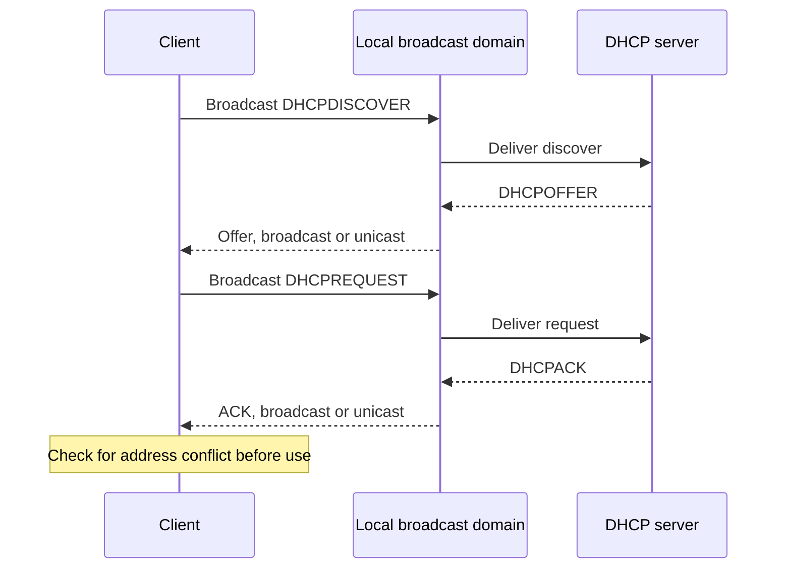

# DHCP IPv4 Lease Acquisition

**DHCP:** provides a client with leased IPv4 configuration through a discover, offer, request, and acknowledgement exchange.

## The Initial Exchange

1. **Discover:** the client broadcasts `DHCPDISCOVER` to find available DHCP servers.
2. **Offer:** a server proposes configuration in `DHCPOFFER`, including an address that the client may use if selected.
3. **Request:** the client broadcasts `DHCPREQUEST` to select one offer and identify the requested configuration.
4. **Acknowledge:** the selected server sends `DHCPACK`, confirming the lease and its configuration.

The exchange uses UDP port `68` at the client and UDP port `67` at the server. A DHCP relay can carry these messages between the client's subnet and a remote server.

During initial selection, `DHCPDISCOVER` and `DHCPREQUEST` are broadcast. `DHCPOFFER` and `DHCPACK` can be broadcast or unicast depending on the client's state and flags.

## Lease Contents and Lifetime

| Lease field | Meaning |
| --- | --- |
| IPv4 address | Address leased to the client |
| Subnet mask | Defines the client's IPv4 subnet |
| Router | Default router for off-subnet traffic |
| DNS servers | Servers used for name resolution |
| Lease duration | How long the configuration remains valid |

An offer proposes an address, but it is not yet a usable lease. The acknowledgement confirms the lease, and the client checks for an address conflict before using the acknowledged address.

> [!warning] Conflict Check Before Use
> If the client detects a conflict, it sends `DHCPDECLINE` and restarts configuration. It must not use the conflicting acknowledged address.

## Worked Lease Example

> [!example] Acknowledged IPv4 Configuration
> A client selects a server's offer and receives `DHCPACK`.
>
> - **Address:** `192.0.2.50`
> - **Mask:** `255.255.255.0`
> - **Router:** `192.0.2.1`
> - **DNS server:** `192.0.2.53`
> - **Duration:** `3600` seconds
>
> **Result:** after the conflict check succeeds, the client can use `192.0.2.50` with the supplied subnet, router, DNS, and temporary lifetime.

## Renewal and Expiry

**Renewal:** a client normally tries to renew the lease before its duration expires.

**Expiry:** when the lease expires without renewal, the client must stop using the leased address and obtain configuration again.

==DHCPACK confirms a lease, but the client uses the address only after its conflict check succeeds.==
