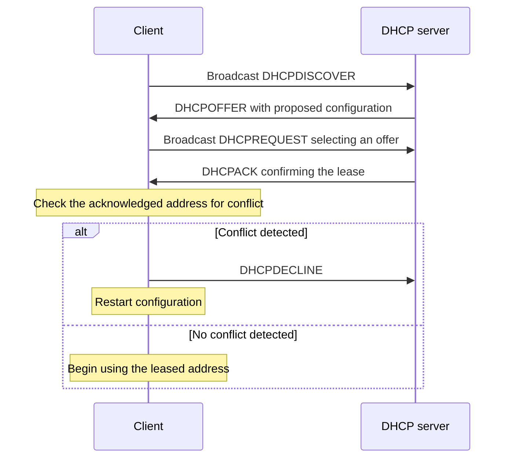

# Obtaining an IPv4 Lease with DHCP

**DHCP:** provides a client with leased IPv4 configuration.

## Initial Lease Exchange

1. **Discover:** the client broadcasts `DHCPDISCOVER` to find available DHCP servers.
2. **Offer:** a server sends `DHCPOFFER` with proposed configuration, including an available IPv4 address.
3. **Request:** the client broadcasts `DHCPREQUEST` to select one offer.
4. **Acknowledge:** the selected server sends `DHCPACK` to confirm the lease.

Servers use UDP port `67`, and clients use UDP port `68`. During initial selection, DISCOVER and REQUEST are broadcast, while OFFER and ACK can be broadcast or unicast depending on the client state and flags.

> [!warning] Offer Is Not a Usable Lease
> `DHCPOFFER` only proposes an address. `DHCPACK` confirms the lease, and the client checks for an address conflict before using it.

## Lease Configuration

A lease can carry the settings needed to use the IPv4 network.

| Field | Example value |
| --- | --- |
| IPv4 address | `192.0.2.50` |
| Subnet mask | `255.255.255.0` |
| Router | `192.0.2.1` |
| DNS server | `192.0.2.53` |
| Lease duration | `3600` seconds |

> [!example] Applying the Lease
> A client receives the five values in the table through the initial exchange.
>
> - **Input:** address `192.0.2.50`, mask `255.255.255.0`, router `192.0.2.1`, DNS server `192.0.2.53`, and duration `3600` seconds.
> - **Check:** verify that the acknowledged address does not conflict with another address.
> - **Result:** when no conflict is found, use `192.0.2.50` with the supplied settings for the lease period.

## Conflict, Renewal, and Relay

**DHCPDECLINE:** reports a detected address conflict. The client sends it and restarts configuration instead of using the acknowledged address.

**Renewal:** a client normally tries to renew its temporary lease before expiry. If the lease expires, the client must stop using the leased address.

**DHCP relay:** carries DHCP exchanges between a client subnet and a remote server.

==An acknowledged address becomes usable only after the client finds no address conflict.==
